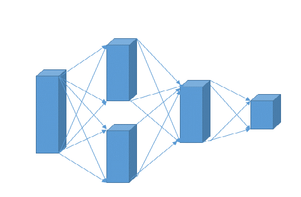

# Introduction
Prediction is always crucial for industry. Regression model include MLP,ConvNet,SVM. there are different preprocessing,e.g. PCA,STD.

# Dataset
Nuclear magnetic resonance spectroscopy 

# Structure

# Details in learning
I train the model using stochastic gradient descent with a batchsize of 30 examples, momentum of 0.9 and weight decay of 0.0005.

# Results
