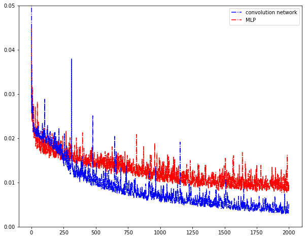

# Introduction
Prediction is always crucial for industry. Regression model include MLP,ConvNet,SVM. there are different preprocessing,e.g. PCA,STD.

# Dataset
Nuclear magnetic resonance spectroscopy 

# Structure

# Details in learning
I train the model using stochastic gradient descent with a batchsize of 30 examples, momentum of 0.9 and weight decay of 0.0005.

# Results
Method | Rp | Rc | RMSEC |RMSEP |RMAEC|  RMAEP | ME
----|-----|-----|-----|-----|-----|-----|-------
MLP | 0.675752850569 | 0.69153614592 | - | - | -| - | -
SVM | 0.801938318796 | 0.786777166316 | 0.206149488747 | 0.240355478698 | 0.390844162744 | 0.240355478698 |1.41258762
ConvNet | - | - | - | - | - | - |-
Merge_Layer | 0.828051483905|0.839381368154 |0.208666147062 |0.155290351723| 0.343100809014 |0.208666147062|1.76916962

